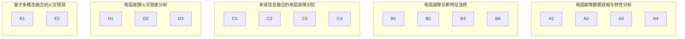

```mermaid
graph TD;


    %% 每个模块的具体内容
    subgraph A [电弧故障数据获取与特性分析]
        direction TB;
        A1;
        A2;
        A3;
        A4;
    end
    
    subgraph B [电弧故障诊断特征选择]
        direction TB;
        B1;
        B2;
        B3;
        B4;
    end
    
    subgraph C [多域信息融合的电弧故障识别]
        direction TB;
        C1;
        C2;
        C3;
        C4;
    end
    
    subgraph D [电弧故障火灾隐患分析]
        direction TB;
        D1;
        D2;
        D3;
    end
    
    subgraph E [基于多模态融合的火灾预测]
        direction TB;
        E1;
        E2;
    end

```