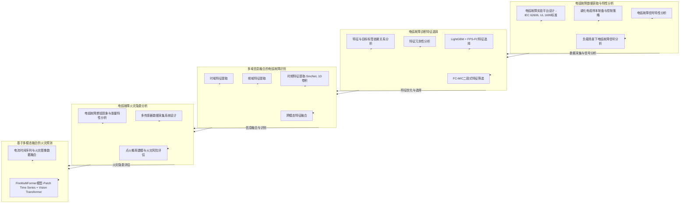

```mermaid
graph TD;
    A[电弧故障数据获取与特性分析] --> B[电弧故障诊断特征选择];
    B --> C[多域信息融合的电弧故障识别];
    C --> D[电弧故障火灾隐患分析];
    D --> E[基于多模态融合的火灾预测];

    %% 电弧故障数据获取与特性分析
    A1[电弧故障实验平台设计 -IEC 62606, UL 1699标准] --> A;
    A2[碳化电缆样本制备与控制策略] --> A;
    A3[电弧故障信号特性分析] --> A;
    A4[负载场景下电弧故障信号分析] --> A;
    
    %% 电弧故障诊断特征选择
    B1[特征与目标标签依赖关系分析] --> B;
    B2[特征冗余性分析] --> B;
    B3[LightGBM + FPS-FC特征选择] --> B;
    B4[FC-MIC二段式特征筛选] --> B;

    %% 多域信息融合的电弧故障识别
    C1[时域特征提取] --> C;
    C2[频域特征提取] --> C;
    C3[时频特征提取-SincNet, 1D卷积] --> C;
    C4[跨模态特征融合] --> C;

    %% 电弧故障火灾隐患分析
    D1[电弧故障燃弧现象与能量特性分析] --> D;
    D2[多传感器数据采集系统设计] --> D;
    D3[点火概率建模与火灾风险评估] --> D;

    %% 基于多模态融合的火灾预测
    E1[电流时间序列与火灾图像数据融合] --> E;
    E2[FireMultiFormer模型-Patch Time Series + Vision Transformer] --> E;
    
    %% 逻辑关系
    A -->|数据采集与信号分析| B;
    B -->|特征优化与选择| C;
    C -->|信息融合与识别| D;
    D -->|火灾隐患评估| E;

    %% 每个模块的具体内容
    subgraph A [电弧故障数据获取与特性分析]
        direction TB;
        A1;
        A2;
        A3;
        A4;
    end
    
    subgraph B [电弧故障诊断特征选择]
        direction TB;
        B1;
        B2;
        B3;
        B4;
    end
    
    subgraph C [多域信息融合的电弧故障识别]
        direction TB;
        C1;
        C2;
        C3;
        C4;
    end
    
    subgraph D [电弧故障火灾隐患分析]
        direction TB;
        D1;
        D2;
        D3;
    end
    
    subgraph E [基于多模态融合的火灾预测]
        direction TB;
        E1;
        E2;
    end

```