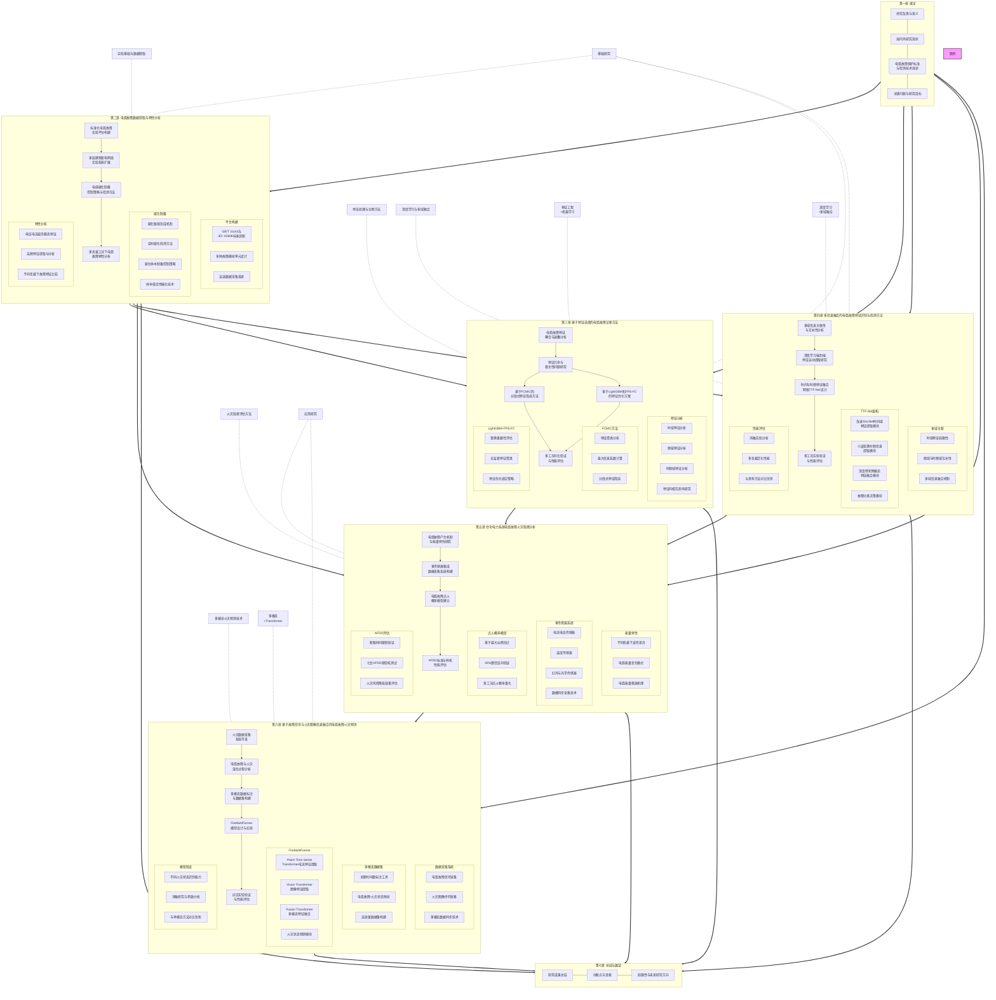

```mermaid
flowchart TB
    subgraph 第一章[第一章 绪论]
        direction TB
        A1[研究背景与意义] --- A2[国内外研究现状]
        A2 --- A3[电弧故障保护标准\n与检测技术现状]
        A3 --- A4[关键问题与研究目标]
    end

    subgraph 第二章[第二章 电弧故障数据获取与特性分析]
        direction TB
        B1[标准化电弧故障\n实验平台构建] --> B2[多层建筑配电网络\n实验系统扩展]
        B2 --> B3[电缆碳化制备\n控制策略与检测方法]
        B3 --> B4[多负载工况下电弧\n故障特性分析]
        
        subgraph 平台构建
            B11[GB/T 31143与\nIEC 62606标准适配]
            B12[多种故障模拟单元设计]
            B13[高速数据采集系统]
        end
        
        subgraph 碳化制备
            B31[碳化路径形成机制]
            B32[实时碳化检测方法]
            B33[碳化样本制备控制策略]
            B34[样本稳定性强化技术]
        end
        
        subgraph 特性分析
            B41[电压电流波形瞬态特征]
            B42[高频特征提取与分析]
            B43[不同负载下故障特征比较]
        end
    end

    subgraph 第三章[第三章 基于特征选择的电弧故障诊断方法]
        direction TB
        C1[电弧故障特征\n耦合与混叠分析] --> C2[特征冗余与\n相关性问题研究]
        C2 --> C3[基于FCMIC的\n分段式特征筛选方法]
        C2 --> C4[基于LightGBM和FPS-FC\n的特征优化方案]
        C3 & C4 --> C5[多工况对比验证\n与性能评估]
        
        subgraph 特征分析
            C11[时域特征分析]
            C12[频域特征分析]
            C13[时频域特征分析]
            C14[特征间相互影响研究]
        end
        
        subgraph FCMIC方法
            C31[特征聚类分析]
            C32[最大信息系数计算]
            C33[分段式特征筛选]
        end
        
        subgraph LightGBM+FPS-FC
            C41[置换重要性评估]
            C42[无监督特征聚类]
            C43[特征优化组合策略]
        end
    end

    subgraph 第四章[第四章 多信息融合的电弧故障特征识别与检测方法]
        direction TB
        D1[多域信息关联性\n与互补性分析] --> D2[深度学习端到端\n特征自动提取研究]
        D2 --> D3[时间与时频特征融合\n网络TTF-Net设计]
        D3 --> D4[多工况实验验证\n与性能评估]
        
        subgraph 多域关联
            D11[时域特征局限性]
            D12[频域与时频域互补性]
            D13[多域信息融合机制]
        end
        
        subgraph TTF-Net架构
            D31[改进SincNet时间域\n特征提取模块]
            D32[小波变换时频信息\n提取模块]
            D33[深度卷积跨模态\n特征融合模块]
            D34[故障分类决策模块]
        end
        
        subgraph 性能评估
            D41[消融实验分析]
            D42[多负载泛化性能]
            D43[与现有方法对比优势]
        end
    end

    subgraph 第五章[第五章 住宅电力系统电弧故障火灾隐患分析]
        direction TB
        E1[电弧故障产生机制\n与能量特性研究] --> E2[多传感器集成\n数据采集系统构建]
        E2 --> E3[电弧故障点火\n概率模型建立]
        E3 --> E4[AFDD标准与样机\n性能评估]
        
        subgraph 能量特性
            E11[不同负载下波形差异]
            E12[电弧能量变化模式]
            E13[电弧能量释放机理]
        end
        
        subgraph 多传感器系统
            E21[电流电压传感器]
            E22[温度传感器]
            E23[红外与光学传感器]
            E24[数据同步采集技术]
        end
        
        subgraph 点火概率模型
            E31[基于最大似然估计]
            E32[95%置信区间验证]
            E33[多工况点火概率量化]
        end
        
        subgraph AFDD评估
            E41[断路时间限制验证]
            E42[七台AFDD原型机测试]
            E43[火灾风险降低效果评估]
        end
    end

    subgraph 第六章[第六章 基于故障信号与火灾图像信息融合的电弧故障火灾预测]
        direction TB
        F1[火灾数据采集\n系统开发] --> F2[电弧故障与火灾\n演化过程分析]
        F2 --> F3[多模态数据标注\n与数据集构建]
        F3 --> F4[FireMultiFormer\n模型设计与实现]
        F4 --> F5[综合实验验证\n与性能评估]
        
        subgraph 数据采集系统
            F11[电弧故障信号采集]
            F12[火灾图像序列采集]
            F13[多模态数据同步技术]
        end
        
        subgraph 多模态数据集
            F31[关键时间戳标注工具]
            F32[电弧故障-火灾状态映射]
            F33[高质量数据集构建]
        end
        
        subgraph FireMultiFormer
            F41[Patch Time Series\nTransformer电流特征提取]
            F42[Vision Transformer\n图像特征提取]
            F43[Fusion Transformer\n多模态特征融合]
            F44[火灾状态预测模块]
        end
        
        subgraph 模型验证
            F51[不同火灾状态识别能力]
            F52[消融研究与参数分析]
            F53[与单模态方法对比优势]
        end
    end

    subgraph 第七章[第七章 总结与展望]
        G1[研究成果总结] --- G2[创新点与贡献]
        G2 --- G3[局限性与未来研究方向]
    end

    %% 章节间逻辑连接
    第一章 ==> 第二章
    第一章 ==> 第三章
    第一章 ==> 第四章
    第一章 ==> 第五章
    第一章 ==> 第六章
    第二章 ==> 第三章 & 第四章
    第二章 ==> 第五章
    第三章 & 第四章 ==> 第五章
    第五章 ==> 第六章
    第二章 & 第三章 & 第四章 & 第五章 & 第六章 ==> 第七章

    %% 研究阶段侧标注
    实验基础["实验基础与数据获取"] -.- 第二章
    特征处理["特征处理与诊断方法"] -.- 第三章
    深度识别["深度学习与多域融合"] -.- 第四章
    火灾评估["火灾隐患评估方法"] -.- 第五章
    火灾预测["多模态火灾预测技术"] -.- 第六章
    
    %% 研究主线标注
    基础研究["基础研究"] -.- 第二章 & 第三章 & 第四章
    应用研究["应用研究"] -.- 第五章 & 第六章

    %% 技术演进路线
    传统技术["特征工程\n+机器学习"] -.- 第三章
    深度技术["深度学习\n+多域融合"] -.- 第四章
    多模态技术["多模态\n+Transformer"] -.- 第六章

    %% 图例说明
    style 图例 fill:#f9f,stroke:#333,stroke-width:2px;
    class 图例 note;

```